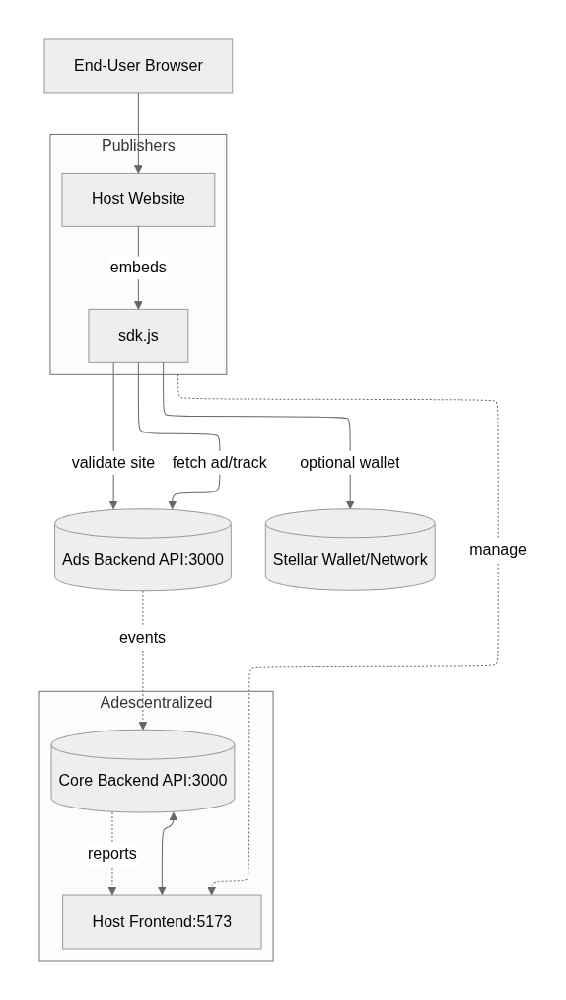
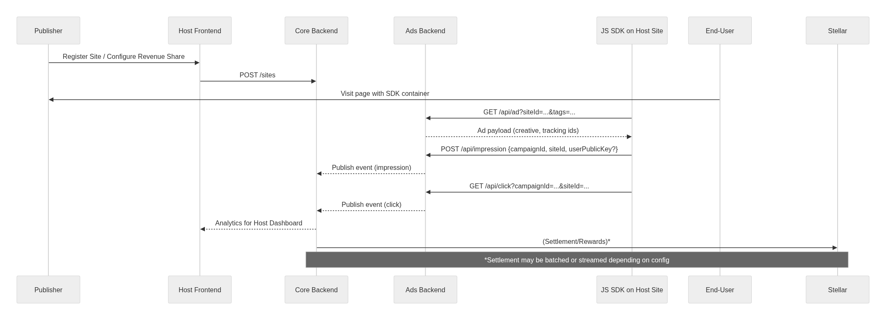

# Adescentralized – Host Frontend (Publisher Interface)

**A React + Vite + Tailwind application that enables website hosts (publishers) to integrate decentralized ads, manage sites, generate SDK code, and track revenue.**

> Part of the **Adescentralized** ecosystem — a Stellar‑powered, privacy‑first advertising platform with on‑chain verification and fair payouts to advertisers, publishers, and users.

---

## 0) Introduction & Context

Adescentralized connects **advertisers**, **publishers (hosts)**, and **users** in a transparent marketplace:

* **Advertisers** fund campaigns and pay only for **verified** impressions/clicks.
* **Publishers** embed a lightweight **SDK** to render ads contextually and receive automatic revenue splits.
* **Users** opt in to view ads and receive **real XLM rewards** via Stellar.

This app is the **Host Frontend**: it provides **publisher dashboards, site management, SDK generators, documentation,** and **demo pages** to validate end‑to‑end flows.

---

## 1) System Architecture

### 1.1 Components

1. **Core Backend** (port `3000`) – user auth, sites, analytics
2. **Ads Backend** (port `3000`, separate service URL) – ad serving & tracking API (ad, impression, click, validate)
3. **Host Frontend (this repo)** (port `5173`) – publisher UI, SDK generator, docs, demos
4. **JavaScript SDK** – embeddable client for third‑party sites (served from `/public/sdk.js` and/or CDN)

### 1.2 Actors

* **Advertisers**: create campaigns
* **Publishers (Hosts)**: register sites, embed SDK, earn revenue
* **End‑Users**: view/click ads and receive XLM rewards

### 1.3 High‑Level Architecture Diagram

<div align="center">



</div>

### 1.4 Event & Reward Sequence

<div align="center">



</div>

---

## 2) Features (Host Frontend)

* **Sites Management** (`/sites`): register domains, configure revenue share, check status
* **SDK Generator** (`/sdk-generator`): generate **HTML**, **vanilla JS**, and **React** snippets with size/tags
* **SDK Docs** (`/sdk-docs`): full integration guide, examples, troubleshooting
* **Hybrid Dashboard** (`/dashboard`): role‑aware analytics; publisher revenue, impressions, CTR, RPM
* **Demo Pages** (`/demo-integration-test.html`, `/demo-sdk.html`): end‑to‑end validation

---

## 3) Tech Stack

* **React 18 + Vite** (TypeScript)
* **TailwindCSS + ShadCN UI** (component primitives under `src/components/ui`)
* **React Router**, Context state
* **ESLint + TSConfig + PostCSS**

---

## 4) Project Structure

```
Adescentralized-Host-Frontend/
├─ public/
│  ├─ sdk.js                      # Public JS SDK (served or pushed to CDN)
│  ├─ demo-integration-test.html  # Full demo page
│  └─ demo-sdk.html               # Simple demo
├─ src/
│  ├─ App.tsx
│  ├─ main.tsx
│  ├─ components/
│  │  ├─ AppSidebar.tsx
│  │  ├─ Layout.tsx
│  │  └─ ui/                      # ShadCN UI primitives
│  ├─ pages/                      # (if present in your tree)
│  ├─ services/
│  │  └─ api.ts                   # API client
│  ├─ index.css
│  └─ themes.css
├─ old_sdk_pages/                  # Legacy prototypes (optional)
├─ package.json
├─ vite.config.ts
├─ tailwind.config.ts
└─ eslint.config.js
```

---

## 5) Getting Started

### 5.1 Prerequisites

* **Node.js 18+**
* **npm** or **bun** (repo includes `bun.lockb`)

### 5.2 Install

```bash
# Install frontend dependencies
bun install
# or
npm install
```

### 5.3 Configure Backends

Set the URLs for the **Core Backend** and **Ads Backend**. You can inject Vite envs:

Create `.env` (or `.env.local`) in this repo:

```env
VITE_CORE_API_BASE=http://localhost:3000
VITE_ADS_API_BASE=http://localhost:3000
VITE_SDK_CDN_URL=http://localhost:5173/sdk.js
VITE_DEFAULT_SITE_ID=demo-site-001
VITE_ENABLE_DEBUG=true
```

> In production, set proper HTTPS origins and CORS policies on both backends.

### 5.4 Run Dev Server

```bash
bun run dev
# or
npm run dev
```

Open **[http://localhost:5173](http://localhost:5173)**.

### 5.5 Production Build & Preview

```bash
npm run build
npm run preview
```

The build output is generated in `dist/`.

---

## 6) SDK Integration (Publishers)

### 6.1 HTML (Simple)

```html
<div id="stellar-ad-container"
     data-site-id="YOUR_SITE_ID"
     data-tags="technology,programming"
     data-size="medium"></div>
<script src="https://cdn.yourdomain.com/sdk.js"></script>
```

### 6.2 Vanilla JavaScript (Configured)

```html
<script>
  window.StellarAdsConfig = {
    siteId: 'YOUR_SITE_ID',
    tags: ['technology', 'programming'],
    size: 'medium',
    debug: true,
    autoRefresh: true,
    refreshInterval: 5,  // minutes
    timeout: 8000,
    retryAttempts: 3,
  };
</script>
<script src="https://cdn.yourdomain.com/sdk.js"></script>
```

### 6.3 React Component

```jsx
import { useEffect } from 'react';

export function AdContainer({ siteId, tags = [], size = 'medium' }) {
  useEffect(() => {
    const script = document.createElement('script');
    script.src = 'https://cdn.yourdomain.com/sdk.js';
    document.head.appendChild(script);
  }, []);

  return (
    <div
      data-site-id={siteId}
      data-tags={tags.join(',')}
      data-size={size}
    />
  );
}
```

### 6.4 Supported Sizes

| Size         | Dimensions | Recommended Placement   |
| ------------ | ---------- | ----------------------- |
| `small`      | 300×250    | Sidebar, inline content |
| `medium`     | 728×90     | Header/banner           |
| `large`      | 970×250    | Leaderboard/hero        |
| `responsive` | Flexible   | Mobile/adaptive         |

### 6.5 Public SDK API

```javascript
// Force refresh all containers
window.StellarAdsSDK.refresh();

// Refresh a specific container by id
document.getElementById('stellar-ad-container');
window.StellarAdsSDK.refresh('stellar-ad-container');

// Inspect version
console.log(window.StellarAdsSDK.version);
```

---

## 7) Ads API (Reference)

**Base URL (dev)**: `http://localhost:3000`

| Endpoint             | Method | Description                 |
| -------------------- | ------ | --------------------------- |
| `/api/ad`            | GET    | Fetch an ad for a site      |
| `/api/impression`    | POST   | Register impression         |
| `/api/click`         | GET    | Register click              |
| `/api/validate-site` | GET    | Validate site configuration |
| `/api/sites`         | GET    | List sites                  |

### 7.1 Examples

```bash
# Fetch ad
curl "http://localhost:3000/api/ad?siteId=test-site-001&tags=tech,programming"

# Validate site
curl "http://localhost:3000/api/validate-site?siteId=test-site-001"
```

```bash
# Register impression
curl -X POST "http://localhost:3000/api/impression" \
  -H 'Content-Type: application/json' \
  -d '{
    "campaignId": "cmp_123",
    "siteId": "test-site-001",
    "userPublicKey": "G...",  
    "hasWallet": true
  }'

# Register click
curl "http://localhost:3000/api/click?campaignId=cmp_123&siteId=test-site-001"
```

---

## 8) Host Workflows

### 8.1 Register a Site

1. Go to **`/sites`**
2. Click **Add Site**
3. Provide **name**, **domain**, **revenue share**
4. Save and verify with **Validate Site**

### 8.2 Generate SDK Code

1. Open **`/sdk-generator`**
2. Select your site and **ad size**
3. Add contextual **tags**
4. Copy HTML/JS/React snippet

### 8.3 Validate End‑to‑End

* Use **`/demo-integration-test.html`** to verify:

  * API reachable
  * Ad renders
  * Impression & click tracking
  * Rewards flow (if a wallet is connected)

---

## 9) Testing & Validation

### 9.1 Automation Script

```bash
chmod +x ./test-integration.sh
./test-integration.sh
```

The script exercises ad retrieval, impression/click endpoints, and basic SDK checks.

### 9.2 Manual Test Checklist

* API status reachable
* Containers render across sizes (`small`, `medium`, `large`, `responsive`)
* Impression and click tracking increment metrics
* Rewards credited when wallet is connected
* Debug logs visible with `window.StellarAdsConfig = { debug: true }`

---

## 10) Deployment

### 10.1 Build & Host

```bash
npm run build
```

Deploy `dist/` to **Vercel**, **Netlify**, or **S3 + CloudFront**.

### 10.2 SDK via CDN

Host `public/sdk.js` on a CDN for third‑party sites:

```html
<script src="https://cdn.yourdomain.com/sdk.js"></script>
```

## 11) Security, Privacy & Fraud Prevention (Frontend & SDK)

* **Privacy‑first**: contextual targeting only; no cross‑site profiling
* **CSP/HSTS** on production hosting
* **CORS** restricted to known origins
* **SDK**: minimal permissions; debounced network calls; replay‑safe endpoints
* **Anti‑fraud signals** captured by SDK (viewability, dwell time, focus/blur, pointer events) and processed by backends

---

## 12) Observability

* **Console Debug**: `window.StellarAdsConfig.debug = true`
* **Browser DevTools**: network tracing for `/api/ad`, `/api/impression`, `/api/click`
* Backends export metrics/logs consumed by the Host Dashboard (impressions, clicks, CTR, RPM, revenue)

---

## 13) Troubleshooting

### 13.1 Ads don’t render

1. Ensure Ads API reachable: `curl http://localhost:3000/api/ad?siteId=test`
2. Check `data-site-id` and `data-size`
3. Enable debug: `window.StellarAdsConfig = { debug: true }`

### 13.2 Rewards not updating

1. Ensure a Stellar wallet is connected (if required for rewards)
2. Confirm Ads Backend sends events to Core Backend
3. Retry or increase `retryAttempts` in SDK config

### 13.3 CORS errors

1. Add the Frontend origin to backend CORS allowlist
2. Use HTTPS and matching protocols
3. Verify `VITE_*` envs point to correct API hosts

### 13.4 SDK not initialized

1. Load configuration **before** including `sdk.js`
2. Wait for `DOMContentLoaded`
3. Inspect `window.StellarAdsSDK.instance` in console

---

## 14) Roadmap

* Real‑time analytics from Contracts API
* Extended fraud prevention signals & scoring
* A/B testing in SDK
* i18n (English + Portuguese)
* WordPress plugin & Mobile SDK

---

## 15) Contribution Guidelines

* Conventional Commits (`feat:`, `fix:`, `docs:`)
* ESLint/Prettier and TypeScript checks must pass
* Ensure `npm run build` succeeds before PR
* PRs must describe test steps and impact on SDK/public API

---

## 16) License

MIT (update if different)

---

## 17) Context Reminder (Project‑level)

Adescentralized addresses **high costs**, **opacity**, and **fraud** in digital ads by using **Stellar** for low‑fee, fast settlements and **smart contracts** for transparent splits among advertisers, publishers, and users. This Host Frontend is the publisher’s gateway to that ecosystem — from **site onboarding** to **SDK integration** to **revenue analytics**.

**Version**: Host Frontend & SDK v2.0.0
**Last Updated**: September 2025
