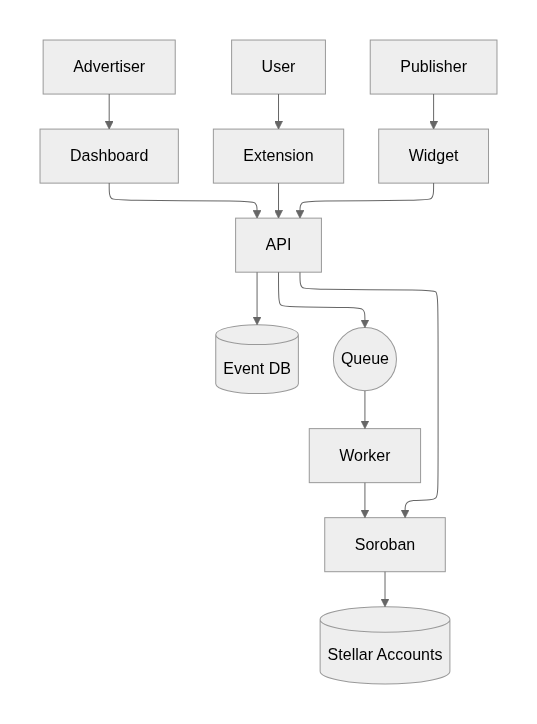
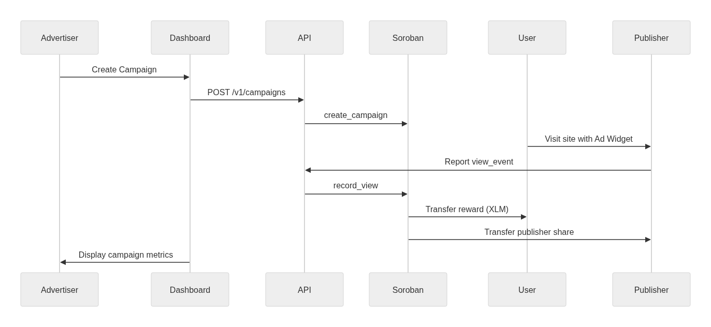
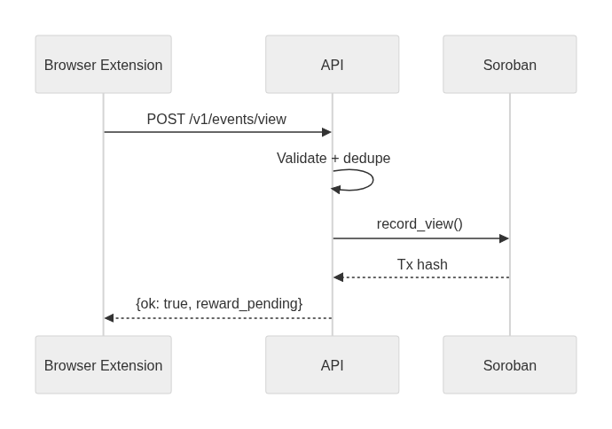

# Adescentralized – Technical Documentation (v1.0, English)

> Living document for the full technical specification of the Adescentralized platform. Updated as we integrate each codebase module.

---

## 0) Executive Summary & Scope

**Mission**: To deliver transparent, fair, and efficient advertising distribution with on‑chain verification and instant, automatic payouts through the Stellar blockchain.

**System Components**:

* **Smart Contracts (Soroban / Rust)**: Core logic for campaign management, event recording, and settlement.
* **Contracts API (Node.js / Express)**: Gateway for campaign creation, event validation, reporting, and orchestration with Stellar.
* **Advertiser Dashboard (Web App)**: Campaign management and performance monitoring with transparency on ad spend.
* **Browser Extension (Users)**: Allows end‑users to opt in, view ads, and receive direct XLM rewards.
* **Publisher Widget & SDK**: Embeddable widget for publishers to display ads and capture telemetry.
* **Analytics & Data Pipeline**: Event ingestion, fraud detection heuristics, reporting, and insights.
* **Treasury & Payments**: Stellar account orchestration, settlement distribution, fiat on/off‑ramps.
* **Infrastructure & DevOps**: AWS deployment, CI/CD, monitoring, observability.

**Non‑Goals (MVP)**:

* Real‑time bidding (RTB)
* User profiling or behavioral targeting
* Complex identity graphs

---

## 1) System Architecture Overview

### 1.1 Logical Architecture

* **Client Layer**: Browser Extension, Publisher Widget, Advertiser Dashboard
* **API Layer**: Nginx/API Gateway → Contracts API → Workers
* **Blockchain Layer**: Soroban Smart Contracts
* **Data Layer**: Event Store (Postgres/DynamoDB), Redis (cache), SQS (queue), Object Storage (ad creatives)
* **Observability Layer**: Prometheus (metrics), Grafana (dashboards), OpenTelemetry (tracing), Loki/CloudWatch (logs)

### 1.2 System Architecture Diagram

### 1.3 High‑Level Sequence

## 2) Smart Contracts (Soroban / Rust)

### 2.1 Modules

* **AdVault**: Handles advertiser deposits and campaign budgets.
* **Campaigns**: Stores campaign metadata (budget, targeting tags, CPM/CPI).
* **Events**: Records validated impressions with hashes.
* **Registry**: Registers publishers and users.
* **Token**: Manages payouts in XLM and potential wrapped tokens.

### 2.2 State Model

* **Campaign**: `{ id, advertiser, budget_total, budget_locked, tags[], status, created_at }`
* **Event**: `{ id, campaign_id, view_hash, user_hash, publisher_id, ts, status }`
* **Balances**: `{ user_id -> accrued, publisher_id -> accrued }`

### 2.3 Public Functions (examples)

* `create_campaign(advertiser, params) -> campaign_id`
* `record_view(campaign_id, view_hash, user_hash, publisher_id, ts) -> event_id`
* `settle(campaign_id) -> SettlementReport`
* `withdraw(address, amount)`
* `register_publisher(pub_addr, tags[])`
* `register_user(user_addr)`

### 2.4 Security Invariants

* Idempotent `record_view` (no double counting)
* Campaign budget caps enforced
* On‑chain proofs for every event

---

## 3) Contracts API (Node/Express)

### 3.1 Responsibilities

* Acts as the central orchestrator for off‑chain and on‑chain interactions
* Validates and deduplicates incoming events
* Provides REST endpoints for dashboard, extension, and publisher SDK
* Calls Soroban smart contracts through Horizon API

### 3.2 API Endpoints (Sample)

* `POST /v1/campaigns` – Create campaign
* `GET /v1/campaigns/:id` – Retrieve campaign details
* `POST /v1/events/view` – Register validated view event
* `POST /v1/settlements/run` – Trigger settlement
* `GET /v1/analytics/*` – Query aggregated metrics

### 3.3 Example API Flow Diagram

## 4) Advertiser Dashboard (Web)

* **Framework**: React / Next.js
* **Features**: Campaign creation, budget control, targeting, analytics
* **Transparency**: Direct links to Stellar transactions (Horizon Explorer)
* **Authentication**: JWT or passkeys

---

## 5) Browser Extension (Users)

* **Purpose**: Enable opt‑in ad viewing with privacy‑first design
* **Flow**: Activate → generate Stellar wallet → receive ads → earn XLM rewards
* **Privacy**: No cross‑site tracking; user\_id is encrypted and rotated
* **Security**: Code‑signed, permissions minimized, automatic updates

---

## 6) Publisher Widget & SDK

* **Integration**: ``
* **API**: `Ades.render(slot, { tags, size })`
* **Telemetry**: Viewability, dwell time, anti‑bot heuristics
* **Revenue Split**: Publisher share defined in Soroban contracts

---

## 7) Data Model & Storage

* **Tables**:

  * `events.view`: `{ event_id, ts, campaign_id, pub_id, user_hash, valid }`
  * `campaigns`: `{ id, advertiser, budget, tags[], status }`
  * `settlements`: `{ id, totals, tx_hash, period }`
* **Retention**: Pseudonymized, time‑bound (GDPR/LGPD compliance)

---

## 8) Payments & Stellar Treasury

* **Accounts**: Treasury, Campaign Escrow, Publisher, User
* **Flow**: Advertiser deposit → Escrow → Event debit → Rewards distributed
* **Fees**: 0.5% transaction fee (below industry benchmarks)
* **On/Off‑Ramp**: Anchors for fiat integration

---

## 9) Fraud Prevention (MVP)

* **Signals**: Viewport visibility, dwell time, pointer events, focus/blur
* **Heuristics**: Device entropy, repetition detection, IP/ASN rate limiting
* **Risk Model**: Scoring + thresholds + manual audit for anomalies

---

## 10) Security, Privacy & Compliance

* **Controls**: HSTS, CSP, WAF, JWT rotation, mTLS, RBAC
* **Threats Mitigated**: Click fraud, replay attacks, impersonation, data leakage
* **Compliance**: GDPR, LGPD (data minimization, right to erasure, consent tracking)

---

## 11) Observability & SRE

* **Metrics**: RPS, latency p95, valid view rate, error rates
* **Logs**: Structured, PII‑free, correlation IDs
* **Tracing**: OpenTelemetry across services
* **Dashboards**: Availability, settlements, ad spend pacing
* **Runbooks**: Queue backlog, contract out‑of‑funds, failed settlements

---

## 12) Performance & Load Testing

* **Tooling**: k6 load test scripts
* **Scenario**: 10,000 impressions in 2 minutes
* **Metrics**: Latency, throughput, autoscaling behavior
* **Failure Simulation**: Queue overload, contract timeout, DB saturation

---

## 13) DevOps & Deployment (AWS)

* **Infra as Code**: Terraform/CDK
* **Topology**: ALB → ECS/EC2 → RDS/DynamoDB → SQS
* **CI/CD**: GitHub Actions (Rust & Node builds, automated tests, deployments)
* **Secrets**: AWS SSM & KMS

---

## 14) Roadmap (Technical)

* **Q1**: MVP on Stellar testnet (campaigns, events, settlements)
* **Q2**: Pilot with 500 users (browser extension + publishers)
* **Q3**: Advanced settlement logic, recurring payouts
* **Q4**: Fiat on/off‑ramp integrations

Vision: Become the default protocol for transparent, user‑centric advertising in emerging markets.

---

## 15) Threat Model (STRIDE)

* **Spoofing**: Encrypted rotating user IDs
* **Tampering**: HMAC & TLS, idempotency keys
* **Repudiation**: On‑chain proofs, audit logs
* **Information Disclosure**: Encrypted storage, strict minimization
* **DoS**: Rate limiting, queues, auto‑scaling
* **Elevation of Privilege**: RBAC, least privilege, code signing