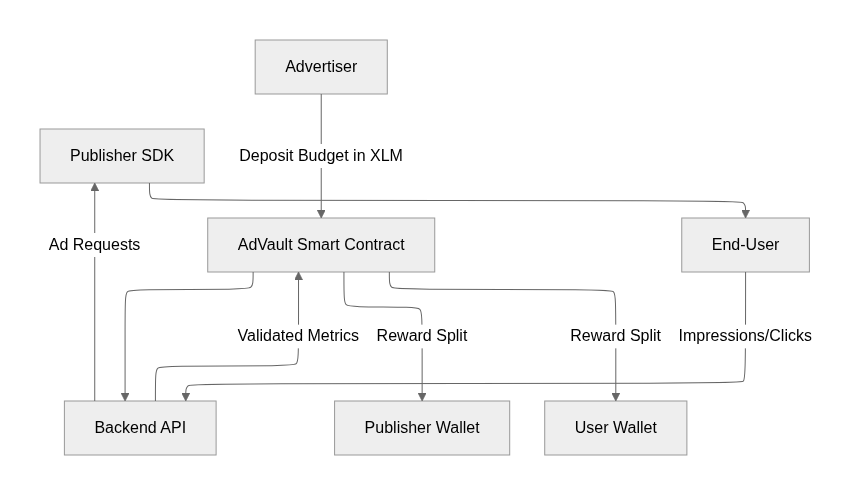

# Adescentralized: Decentralized Advertising on Stellar

## Links:
[Adescentralized-Application](./Adescentralized-Application/)
[Adescentralized-Browser-Extension](./Adescentralized-Browser-Extension/)
[Adescentralized Contracts](./Adescentralized-Contracts/)
[Adescentralized Docs](./Adescentralized-Docs/)
[Adescentralized Host Frontend](./Adescentralized-Host-Frontend)
[Adescentralized SDK](./Adescentralized-SDK/)
[Adescentralized WebApp](./Adescentralized-Webapp/)
[Example Website](./Example-Website/)


[Video Demo](https://youtu.be/xCflrFAnVE0?si=wYZ1a2ITd8zuAxi7)
[Pitch Deck](https://docs.google.com/presentation/d/15rmLFu1kNhsjPj6Ou5rJVDG6Q1xjY0SSchW6pWjQ2rc/edit?usp=sharing)

[Link para Acessar a organização com os Repositórios do Projeto](https://github.com/orgs/Adescentralized/repositories)
> Obs

## 1. Executive Summary

The global digital advertising market suffers from **opacity, high intermediary costs, and rampant fraud**. Small publishers struggle to monetize effectively, advertisers overspend without transparency, and end-users rarely share in the value they generate.

**Adescentralized** is a decentralized advertising platform powered by the **Stellar blockchain**.
It enables advertisers, publishers, and end-users to interact in a **transparent, trustless ecosystem** where:

* **Advertisers** can create campaigns with clear budgets and targeting rules.
* **Publishers** (website owners) can easily integrate ads via our **JavaScript SDK** and receive automatic payouts in XLM.
* **End-users** are rewarded with tokens for their verified interactions (impressions and clicks).

This creates a **fairer distribution of value** across the advertising chain while reducing fraud through on-chain verification and automated micropayments.

In one sentence:
**Adescentralized makes advertising fair, transparent, and decentralized — powered by Stellar smart contracts.**

---

## 2. Problem Statement (Ideation & Value Proposition)

### The Market Problem

* **Fraud**: Up to 30% of online ad traffic is invalid, draining billions from advertisers annually.
* **Opacity**: Advertisers have little visibility into where their money goes, and publishers cannot verify fair distribution.
* **High Intermediary Costs**: Centralized ad networks charge significant fees, reducing publishers’ revenue share.
* **End-User Exclusion**: Users generate the data and attention that power ads but are rarely compensated.

### Target Audience

* **Advertisers**: Brands, startups, and agencies looking for cost-efficient and transparent ad campaigns.
* **Publishers**: Website owners, bloggers, and platforms seeking additional monetization streams.
* **End-users**: Individuals who interact with ads and can be incentivized to participate fairly.

### Value Proposition

Adescentralized delivers value through:

* **Transparency**: All payments and rewards are recorded on Stellar’s blockchain.
* **Fair Revenue Share**: Publishers receive up to 70% of ad spend directly, without middlemen.
* **User Rewards**: End-users earn XLM for verified impressions and clicks.
* **Micropayments at Scale**: Stellar enables fast, low-cost transactions, unlocking real-time payouts.
* **Anti-Fraud Mechanisms**: Smart contracts and cooldown logic reduce click-farming and fraudulent activity.

Our solution transforms the ad ecosystem into a **trustless, transparent, and incentive-aligned model**, leveraging Stellar’s capabilities to solve a real-world billion-dollar problem.


---

## 3. Solution Overview

Adescentralized is structured as a **modular ecosystem**, where each component interacts seamlessly to guarantee transparency, fairness, and automation:

### 🔹 Core Components

1. **Smart Contracts (Soroban, Stellar):**

   * Handle advertiser deposits into a secure vault.
   * Automate distribution of rewards to publishers and end-users.
   * Enforce anti-fraud rules (cooldowns, verified impressions).

2. **Backend Services (Node.js APIs):**

   * Manage campaigns, sites, and user accounts.
   * Record impressions/clicks and trigger contract calls.
   * Provide analytics dashboards for advertisers and publishers.

3. **Publisher Host Frontend (React):**

   * Dashboard for publishers to register websites, generate SDK snippets, and track revenue.

4. **JavaScript SDK:**

   * Lightweight script integrated into publisher websites.
   * Loads ads, tracks impressions/clicks, and communicates with backend/contract.
   * Supports multiple formats (small banners, responsive ads).

5. **Browser Extension (Optional for Users):**

   * Allows end-users to opt-in to see ads.
   * Provides real-time notifications of rewards credited to their Stellar wallet.

6. **Example Website:**

   * Demonstrates end-to-end SDK integration and payment flow.

---

### 🔹 User Flows

#### Advertiser Flow

1. Creates campaign → Defines budget in XLM, cost per click, and targeting tags.
2. Deposits funds into **AdVault smart contract**.
3. Ads are automatically distributed to matching publishers.
4. Receives real-time analytics (impressions, CTR, spending).

#### Publisher Flow

1. Registers website on host dashboard.
2. Generates SDK snippet and embeds in site.
3. Ads are served automatically, with impressions and clicks recorded.
4. Stellar contract pays publisher share in near real-time.

#### End-User Flow

1. Browses a participating website or extension.
2. Views or clicks ads.
3. Smart contract verifies the action and distributes XLM directly to user’s wallet.

---

### 🔹 Architecture Diagram

<div align="center">



</div>

---

## 4. Blockchain Applicability

Adescentralized is **built for Stellar** — the blockchain is not an add-on, but the **core enabler** of the solution.

### Why Stellar?

* **Micropayments at Scale:** Stellar enables transactions as low as \$0.00001 with finality in 3-5 seconds. This makes **per-impression payouts** feasible for the first time.
* **Soroban Smart Contracts:** Campaign funds are locked in the AdVault contract, ensuring that advertisers only pay for **verified interactions**, and publishers/users are paid automatically.
* **Transparency & Auditability:** Every payment and campaign interaction can be traced on-chain, eliminating hidden fees or manipulation.
* **Inclusion:** Stellar’s mission of **financial access** aligns perfectly with rewarding users worldwide, especially in emerging markets.

### Current Implementation

* Contracts are compiled in Rust → WebAssembly (WASM) and deployed on **Stellar Testnet**.
* Campaign creation, site registration, and reward flows are fully tested against testnet contracts.
* End-to-end demo integrates SDK, backend APIs, and Soroban smart contracts.

### Future Scalability

* Migration to **Stellar Mainnet** for production-grade use.
* Integration with **Anchors** for fiat on/off ramps, enabling advertisers to fund campaigns in local currency while publishers/users are paid in XLM.
* Extension into mobile SDKs (React Native, Flutter) to expand ad distribution beyond websites.

In summary: **without Stellar’s speed and low fees, our model of per-impression, per-click micropayments would not be economically viable.** Blockchain is not just applicable, it is essential.

---

## 5. Real-World Potential

### Market Opportunity

* The **digital advertising industry** is projected to surpass **\$678 billion by 2025**.
* Small and medium businesses (SMBs) represent a massive underserved segment, struggling with **high CPCs** and **lack of transparency**.
* Publishers and creators often lose **30–45% of ad revenue** to intermediaries, while end-users remain excluded from value distribution.

### Why Adescentralized Matters

* **For Advertisers:** Lower costs, fraud reduction, and verifiable campaign performance.
* **For Publishers:** Higher direct revenue, instant payouts, and full transparency.
* **For Users:** A share of ad value, creating financial inclusion while respecting privacy.

### Scalability & Viability

* **Micropayment Model:** Stellar’s efficiency allows **per-view payments**, a model that traditional payment rails cannot sustain.
* **Global Reach:** Works across borders with **multi-currency paths** supported by Stellar.
* **Business Model:**

  * 0.5% transaction fee on payouts (competitively below existing networks).
  * Premium analytics and reporting for advertisers.
  * API monetization for third-party integrations.

### Beyond the Hackathon

* **Adoption Roadmap:**

  * MVP live on Stellar Testnet.
  * Pilot programs with niche publishers (blogs, indie news sites).
  * Integration with fiat on/off ramps for advertiser convenience.
  * Expansion into influencer marketing and mobile SDKs.
* **Long-Term Vision:** To become a **new standard for transparent advertising**, reducing fraud and empowering users globally, especially in **emerging markets**.

With a proven market need, a scalable technical foundation, and clear monetization paths, Adescentralized has potential to extend far beyond the hackathon stage.

---

## 6. User Experience (UI/UX)

### Guiding Principles

* **Simplicity:** Onboarding in minutes for advertisers, publishers, and users.
* **Transparency:** Clear dashboards showing earnings, spends, and metrics.
* **Trust:** Every action (impression, click, payment) is verifiable on-chain.

### For Advertisers

* Intuitive dashboard to:

  * Create campaigns (budget, CPC, targeting tags).
  * Monitor real-time analytics (CTR, impressions, spend).
  * Deposit/withdraw funds directly with Stellar wallets.
* Clean UI with **step-by-step campaign creation**.

### For Publishers

* Dedicated **Publisher Host Dashboard**:

  * Register multiple sites with revenue share.
  * Generate SDK snippets in HTML, JS, or React.
  * Track real-time earnings and performance.
* Zero technical friction — copy and paste SDK code into their site.

### For End-Users

* Seamless integration:

  * Opt-in via browser extension or participating site.
  * Receive **instant notifications of XLM rewards**.
  * Manage wallet balances and history.
* No invasive ads or personal data tracking — only **contextual relevance**.

### Visual Identity

* **Clean, modern interfaces** built with React.
* **Responsive design** for both desktop and mobile.
* **Accessible UX** ensuring easy use even for non-technical participants.

### UX Impact

* Advertisers gain **control**.
* Publishers gain **trust and revenue**.
* Users gain **fair rewards**.

The UI/UX was designed to be **accessible, enjoyable, and transparent**, addressing one of the biggest pain points of the current advertising ecosystem: complexity and distrust.

---

## 7. Technical Architecture

This section explains how all modules fit together and how data moves through the system. Diagrams are rendered directly in Markdown (ASCII) as requested.

### 7.1 Component Map (High-Level)

```
+-------------------+        +-------------------+        +----------------------+
|   Advertiser UI   |        |   Host Frontend   |        |   Browser Extension  |
|  (Web Dashboard)  |        | (Publisher Portal)|        |   (User Opt-in)      |
+---------+---------+        +---------+---------+        +----------+-----------+
          |                            |                             |
          | HTTPS/JSON                 | HTTPS/JSON                  | HTTPS/JSON
          v                            v                             v
+--------------------------------------------------------------------------------+
|                             Core Application (APIs)                            |
|  Node.js / Express                                                              |
|                                                                                |
|  +-------------------+  +----------------+  +----------------+  +------------+ |
|  |  Campaigns API    |  |   Sites API    |  |   Events API   |  | Wallet API | |
|  | (/v1/campaigns)   |  | (/v1/sites)    |  | (/v1/events)   |  | (/wallet)  | |
|  +---+-----------+---+  +-------+--------+  +--------+-------+  +-----+------+ |
|      |           |              |                    |                |        |
|      |           |              |                    |                |        |
|      v           v              v                    v                v        |
|  +--------+  +--------+   +-----------+        +-----------+    +-----------+ |
|  |  Auth  |  |  ACL   |   | Anti-fraud|        |  Analytics |    |  Ledger   | |
|  +--------+  +--------+   +-----------+        +-----------+    +-----------+ |
|                                                                                |
+------------------------------------+--------------------+----------------------+
                                     |                    |
                                     | Soroban/Horizon    | SQL/Cache/Queues
                                     v                    v
                           +-------------------+   +----------------------------+
                           |  Soroban Contracts|   |   Data Plane               |
                           |  (WASM on Stellar)|   |  - Postgres/SQLite         |
                           |  - AdVault        |   |  - Redis (cache)           |
                           |  - Token          |   |  - SQS/Worker (optional)   |
                           |  - Registry       |   |  - Object store (creatives)|
                           +---------+---------+   +----------------------------+
                                     |
                                     | Stellar Network (Testnet/Mainnet)
                                     v
                               +-----------+
                               |  Stellar  |
                               |  Ledger   |
                               +-----------+
```

### 7.2 End-to-End Data Flow (Campaign ➜ Ad Delivery ➜ Rewards)

```
(1) Advertiser
    |
    | Create campaign (budget XLM, CPC, tags)
    v
[Campaigns API] --locks budget--> [AdVault contract] --on-chain deposit--> [Stellar]

(2) Publisher
    |
    | Register site, set revenue share
    v
[Sites API] --> stores site & config

(3) SDK on Publisher Site
    |
    | GET /api/ad?siteId=...&tags=...
    v
[Events/Ads Service] --select creative--> returns ad payload

(4) User sees ad
    |
    | POST /v1/events/impression  (signals: visibility, dwell, focus)
    v
[Events API] --validate/anti-fraud--> record event
    |
    |   if valid -> debit from campaign accruals
    v
[Campaigns API] --payout trigger--> [Token/AdVault contracts]
    |
    | on-chain splits (publisher %, user %)
    v
[Stellar Ledger] --finality--> balances updated

(5) Dashboards
    |
    | GET /analytics
    v
[Analytics Service] aggregates events, spend, CTR, RPM, revenues
```

### 7.3 Module Responsibilities

| Module / Repo                     | Purpose                                                                    | Key Interfaces                                        |
| --------------------------------- | -------------------------------------------------------------------------- | ----------------------------------------------------- |
| **Adescentralized-Contracts**     | Soroban smart contracts: **AdVault**, **Token**, **Registry**, **Events**  | `soroban contract invoke`, RPC                        |
| **Adescentralized-Application**   | Core REST APIs: campaigns, sites, events, wallet/payments, analytics       | `/v1/campaigns`, `/v1/sites`, `/v1/events`, `/wallet` |
| **Adescentralized-Host-Frontend** | Publisher portal (register sites, generate SDK, monitor revenue)           | Calls Core APIs                                       |
| **Adescentralized-Webapp**        | Advertiser dashboard (create/fund campaigns, analytics)                    | Calls Core APIs                                       |
| **Adescentralized-SDK**           | Lightweight JS to fetch/render ads and emit telemetry (impressions/clicks) | Hits ads/events endpoints                             |
| **Browser Extension**             | Optional user opt-in, UX enhancements and reward notifications             | Hits events/wallet endpoints                          |
| **Example-Website**               | End-to-end demo app embedding the SDK                                      | Static + SDK                                          |

### 7.4 Contract Surface (Soroban)

* **AdVault**

  * `create_campaign(advertiser, params)` → `campaign_id`
  * `fund(campaign_id, amount)` → lock XLM
  * `debit(campaign_id, amount)` → accrue spend
  * `settle(campaign_id)` → on-chain split (publisher %, user %), emit tx hashes
* **Token**

  * `transfer(from, to, amount)`
  * `balance_of(address)`
* **Registry**

  * `register_publisher(addr, meta)`
  * `register_user(addr, meta)`
* **Events**

  * `record_view(campaign_id, view_hash, pub_id, user_hash, ts)` (idempotent)
  * Emits logs that index event IDs (auditable trail)

> **Invariants:** no double-spend; budget caps enforced; idempotent event recording; access control (advertiser, publisher, admin).

### 7.5 Core API Surface (Selected)

* `/v1/campaigns` `POST|GET|PATCH`
* `/v1/sites` `POST|GET|PATCH`
* `/v1/events/impression` `POST`
* `/v1/events/click` `POST`
* `/wallet` `POST /login /balance /transfer`
* `/analytics/*` aggregate metrics (CTR, RPM, spend, revenues)

**Cross-cutting**

* **Auth**: JWT/Passkeys (UI) + HMAC or Idempotency-Key (SDK events)
* **Validation**: payload schemas; replay protection; rate limits for `/events/*`

### 7.6 Data Model (Simplified)

```
campaigns(id, advertiser_id, status, budget_total, budget_locked, cpc, tags[], created_at)
sites(id, publisher_id, domain, revenue_share, status, created_at)
events(id, type{impression|click}, campaign_id, site_id, user_hash, ts, valid, signals_json)
payouts(id, campaign_id, period, publisher_amount, user_amount, fee_amount, tx_hash, ts)
users(id, role{advertiser|publisher|user}, email?, stellar_address, created_at)
```

* **Signals stored** in `events.signals_json` (viewability %, dwell time, focus/blur, pointer activity).
* **Privacy**: `user_hash` is rotated/pseudonymized.

### 7.7 Environments & Config

| Key                    | Dev (Testnet)                                 | Prod (Mainnet)                |
| ---------------------- | --------------------------------------------- | ----------------------------- |
| `HORIZON_URL`          | `https://horizon-testnet.stellar.org`         | `https://horizon.stellar.org` |
| `SOROBAN_RPC_URL`      | testnet/futurenet RPC                         | mainnet RPC                   |
| `DB_URI`               | SQLite / local Postgres                       | Managed Postgres              |
| `CORS_ALLOWED_ORIGINS` | `http://localhost:5173` etc.                  | Frontends + publisher domains |
| `SDK_CDN_URL`          | local `/public/sdk.js`                        | global CDN                    |
| `PAYOUT_SPLIT`         | `publisher: 70%`, `user: 30% - fee` (example) | configurable per campaign     |

### 7.8 Deployment Topology

```
+------------------+     +-------------------+     +---------------------------+
|  CDN (SDK + FE)  | --> |  API Gateway/WAF  | --> | Core Application (ECS/EKS)|
+------------------+     +-------------------+     +-----------+---------------+
                                                   |  Workers  |  Metrics/Logs |
                                                   +-----+-----+-----+---------+
                                                         |           |
                                                         v           v
                                                +----------------+  +------------------+
                                                | Postgres / RDS |  | Prom/Grafana/ELK|
                                                +--------+-------+  +------------------+
                                                         |
                                                         v
                                                 +---------------+
                                                 | Soroban/Stel. |
                                                 |  (Test/Main)  |
                                                 +---------------+
```

### 7.9 Security Boundaries

* **Edge**: WAF + strict CORS; HSTS; TLS only.
* **APIs**: schema validation; rate limits; idempotency for event ingestion; replay protection.
* **SDK**: minimal data, no cross-site tracking; debug mode gated.
* **Contracts**: access controls; budget ceilings; non-reentrancy by design; event idempotency.
* **Secrets**: KMS/SSM; no secrets in images.
* **Privacy**: pseudonymized user identifiers; data minimization; retention windows.

### 7.10 Observability & SLOs

* **Golden signals**: RPS, p95 latency, 5xx rate, valid/invalid event ratio, settlement lag.
* **Tracing**: request → validation → contract call → ledger confirm.
* **Dashboards**: campaign spend, CTR, RPM, payouts/time.
* **SLO examples**:

  * Ingest latency (impression → stored): p95 < 200 ms
  * Settlement trigger to ledger finality: p95 < 10 s (testnet)
  * Event acceptance error rate: < 0.5% (over 5 min)

---

## 8. Technical Deep Dive

This section covers **key APIs** and **contract methods** with practical examples for developers and judges.

### 8.1 Smart Contracts (Soroban)

#### AdVault Contract

Handles campaign budgets, event validation, and payouts.

* `create_campaign(advertiser, budget, cpc, tags[])`

  * **Input:** advertiser address, budget in XLM, CPC, targeting tags.
  * **Output:** `campaign_id`.

* `fund(campaign_id, amount)`

  * Advertiser deposits funds.
  * Emits `DepositEvent`.

* `record_event(campaign_id, event_type, site_id, user_hash)`

  * Called when an impression or click is validated by backend.
  * Updates campaign budget.
  * Emits `EventRecorded`.

* `settle(campaign_id)`

  * Splits funds between publisher and user.
  * Example split: Publisher 70%, User 25%, Platform fee 5%.
  * Emits `SettlementEvent` with transaction hash.

#### Token Contract

* `transfer(from, to, amount)` – basic payment primitive.
* `balance_of(address)` – query balances.

#### Registry Contract

* `register_publisher(addr, domain, share)` – adds publisher site to registry.
* `register_user(addr)` – enrolls a new end-user wallet.

---

### 8.2 REST API (Backend)

**Authentication**

* `POST /wallet` → Create account + Stellar wallet (funded via Friendbot on Testnet).
* `POST /wallet/login` → Login with credentials.
* `GET /wallet/:email` → Fetch wallet details.

**Campaigns**

* `POST /v1/campaigns` → Create new campaign.
* `GET /v1/campaigns/:userId` → List advertiser’s campaigns.
* `PATCH /v1/campaigns/:campaignId` → Update campaign.
* `DELETE /v1/campaigns/:campaignId` → Delete campaign.

**Sites**

* `POST /v1/sites` → Register new publisher site.
* `GET /v1/sites/:userId` → List publisher’s sites.
* `GET /v1/sites/:siteId/sdk-code` → Generate SDK snippet.

**Events**

* `POST /v1/events/impression`

  ```json
  {
    "campaignId": "c123",
    "siteId": "s456",
    "userHash": "u789"
  }
  ```
* `POST /v1/events/click`

  ```json
  {
    "campaignId": "c123",
    "siteId": "s456",
    "userHash": "u789"
  }
  ```

**Analytics**

* `GET /v1/dashboard/:userId` → Aggregated metrics: impressions, clicks, CTR, spend, revenue.

---

### 8.3 SDK Usage Example

**HTML Integration:**

```html
<div data-site-id="site123" data-tags="tech,crypto" data-size="medium"></div>
<script src="https://cdn.adescentralized.com/sdk.js"></script>
```

**JavaScript Config:**

```javascript
window.StellarAdsConfig = {
  siteId: 'site123',
  tags: ['tech', 'crypto'],
  autoRefresh: true,
  refreshInterval: 5,
  debug: true
};
```

**React Component:**

```jsx
import { useEffect } from 'react';

function AdContainer({ siteId, tags }) {
  useEffect(() => {
    if (window.StellarAdsSDK) {
      window.StellarAdsSDK.refresh();
    }
  }, []);

  return (
    <div data-site-id={siteId} data-tags={tags.join(',')} data-size="medium" />
  );
}
```

---

## 9. Business Model & Monetization

Adescentralized sustains itself through a **lightweight fee model** designed to be competitive and scalable.

### 9.1 Revenue Streams

| Source               | Description                                                                          | % Revenue Contribution |
| -------------------- | ------------------------------------------------------------------------------------ | ---------------------- |
| **Transaction Fee**  | 0.5% fee on advertiser → publisher/user payouts (lower than Google/Facebook’s \~30%) | \~70%                  |
| **Premium Features** | Advanced dashboards, reporting, fraud analytics                                      | \~10%                  |
| **API Access (B2B)** | Charging NGOs, fintechs, or employers who embed SDK at scale                         | \~20%                  |

### 9.2 Competitive Advantage

* **Lower Costs:** Transaction fee <1% vs 20–45% cut from traditional ad networks.
* **Micropayments:** Enabled only by Stellar’s low-fee infrastructure.
* **Trust:** On-chain verification replaces opaque ad-tech intermediaries.

### 9.3 Scalability

* **Global Reach:** Stellar anchors allow advertisers to fund campaigns in fiat, while payouts remain in XLM.
* **Extensible SDK:** Web SDK now, mobile SDK (React Native/Flutter) next.
* **Publisher Adoption:** Easy onboarding → code snippet integration.

### 9.4 Future Opportunities

* **Influencer Marketing:** Transparent tracking and direct micropayments.
* **E-commerce Ads:** On-chain tracking of sales attribution.
* **Data Marketplace:** Privacy-preserving audience insights sold via opt-in.

The business model is **sustainable, transparent, and highly scalable**, with potential to capture a significant share of the **SMB ad-tech market**.


---

## 10. Roadmap & Future Work

Adescentralized is designed as a **multi-phase journey**, starting with a functional MVP on Stellar Testnet and evolving into a global advertising infrastructure.

### 10.1 Short-Term (0–3 Months) – Hackathon & MVP

* Deploy **Soroban contracts** (AdVault, Token, Registry, Events) on **Stellar Testnet**.
* Implement **backend APIs** for campaigns, sites, events, and wallets.
* Release **Publisher Host Frontend** with SDK generator and revenue dashboards.
* Deliver **JavaScript SDK** for integration in websites.
* Demo website and test scripts to validate impressions/clicks/rewards.

### 10.2 Mid-Term (3–9 Months) – Pilot & Early Adoption

* Launch **pilot program** with 500–1000 real users and 10–20 publishers.
* Integrate **fraud-prevention signals** (viewability metrics, cooldown enforcement, IP/device fingerprinting).
* Add **premium advertiser dashboards** (exportable reports, deeper analytics).
* Implement **fiat on/off ramps** using Stellar Anchors for seamless funding.
* Extend SDK with **responsive ads**, **lazy loading**, and **A/B testing features**.

### 10.3 Long-Term (9–18 Months) – Scaling & Market Penetration

* Deploy on **Stellar Mainnet**, with production-grade infrastructure (Postgres, CDN, rate limiting).
* Expand SDK into **mobile apps** (React Native / Flutter) to capture in-app advertising.
* Build **fraud detection engine** leveraging ML models to identify click farms.
* Form partnerships with **SMB-focused ad agencies**, NGOs, and content creators.
* Add **multi-wallet support** and **automatic staking options** for user rewards.

### 10.4 Vision Beyond 18 Months

* Establish Adescentralized as a **global standard for transparent advertising**.
* Launch **data marketplace** where users can opt-in to sell anonymized insights.
* Explore **integration with other Stellar-based DeFi products** (yield on unspent campaign funds).
* Introduce **governance layer** where publishers and advertisers vote on protocol updates.

---

The roadmap demonstrates that Adescentralized is **not just a hackathon prototype**, but a project with a clear pathway to real-world adoption, technical scalability, and long-term sustainability.


Perfeito 🙌 vamos fechar o ciclo com **Seção 11 – Contribution Guidelines** e **Seção 12 – License** em inglês, já formatado para README.

---

## 11. Contribution Guidelines

Adescentralized is an **open-source initiative**. We encourage contributions from developers, designers, and blockchain enthusiasts who believe in building a fair and transparent advertising ecosystem.

### 11.1 How to Contribute

1. **Fork** the repository.
2. Create a feature branch:

   ```bash
   git checkout -b feature/your-feature
   ```
3. Make your changes, following the coding guidelines.
4. Run tests locally to ensure stability.
5. Commit with a clear message:

   ```bash
   git commit -m "feat: add new fraud detection logic"
   ```
6. Push to your fork and submit a **Pull Request**.

### 11.2 Code Style

* **Backend:** Node.js + Express. Follow ESLint + Prettier formatting.
* **Frontend:** React + TypeScript. Use functional components and hooks.
* **Contracts:** Rust for Soroban. Follow Rustfmt and Clippy standards.
* **Commits:** Use [Conventional Commits](https://www.conventionalcommits.org/) (`feat`, `fix`, `docs`, `refactor`).

### 11.3 Testing

* Unit tests for API endpoints (Jest).
* Integration tests for SDK (Playwright or Puppeteer).
* Contract testing with **Soroban CLI** on Testnet.

### 11.4 Communication

* **GitHub Issues**: Report bugs, request features.
* **Discussions**: Propose new ideas and improvements.
* **Community Calls** (future): Monthly sync with contributors.

### 11.5 Security Practices

* Never commit private keys or secrets.
* Report vulnerabilities privately via `security@adescentralized.com`.
* Follow Stellar’s [security guidelines](https://developers.stellar.org/docs/security).

---

## 12. **Team** 👥

* [Marco Ruas](https://www.linkedin.com/in/marcoruas/): full stack
* [Vinicius Testa](https://www.linkedin.com/in/vinicius-testa-passos/): Web3 developer
* [Gustavo Gonçalves](https://www.linkedin.com/in/gustavo-dacosta/): full stack
* [Giovanna Vieira](https://www.linkedin.com/in/giovanna-britto/): Web3 developer
---

## 13. **License**

* MIT ou Apache 2.0